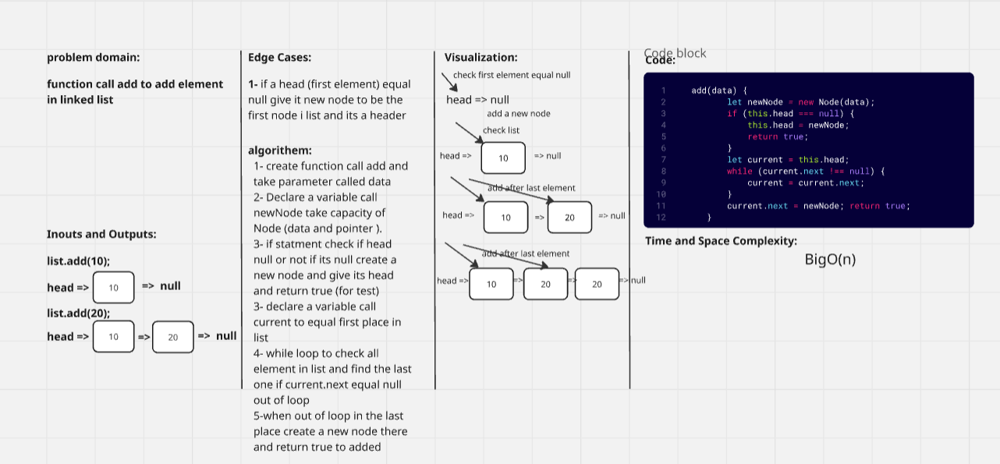
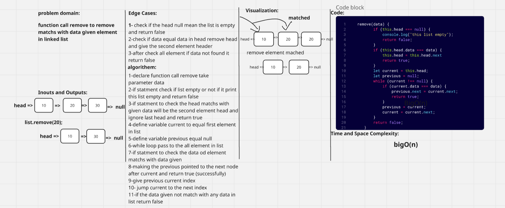
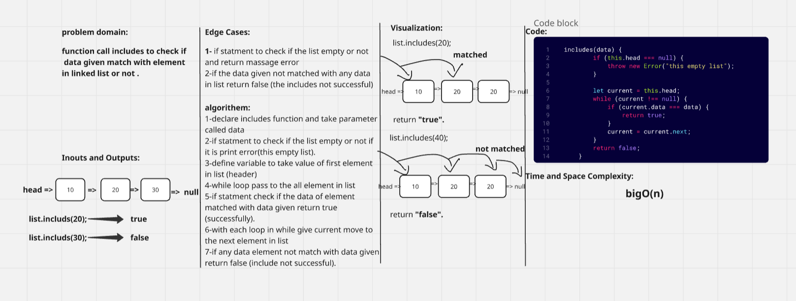
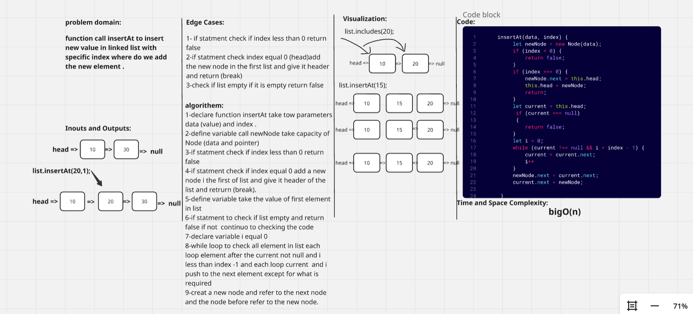
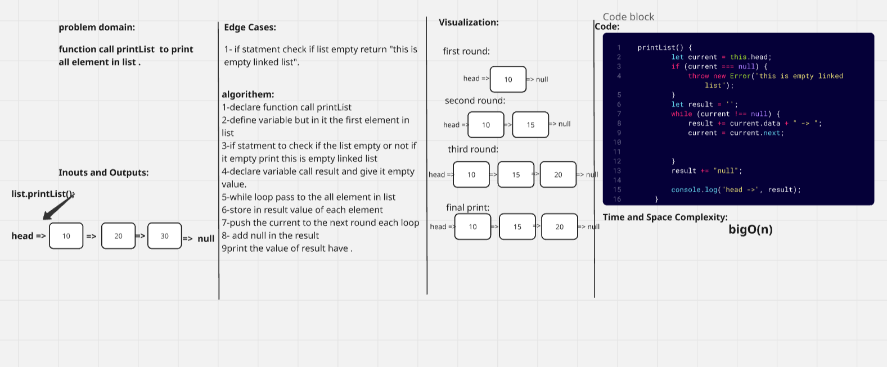
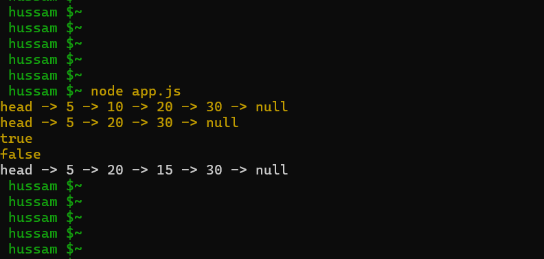
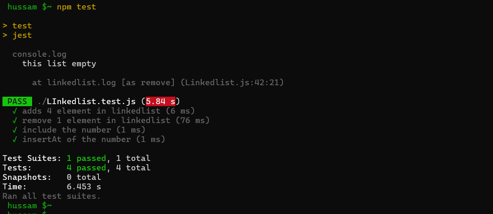

# Linked List Implementation 

## white board

### whiteBoard-Add

### whiteBoard-Remove

### whiteBoard-Includes

### whiteBoard-InsertAt

### whiteBoard-Print

### Console-Logout

### Test-Output
