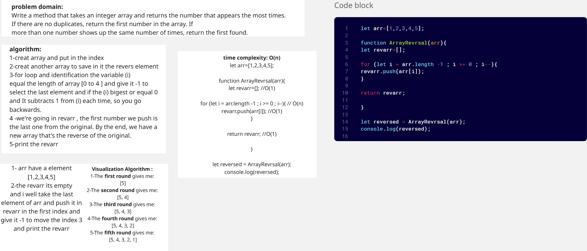
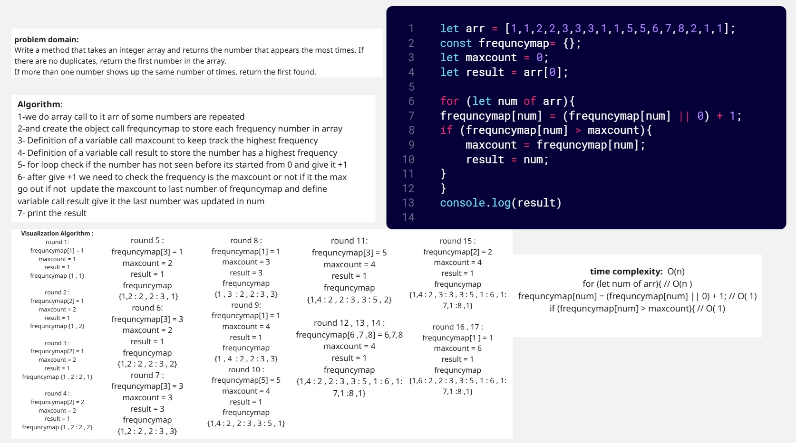
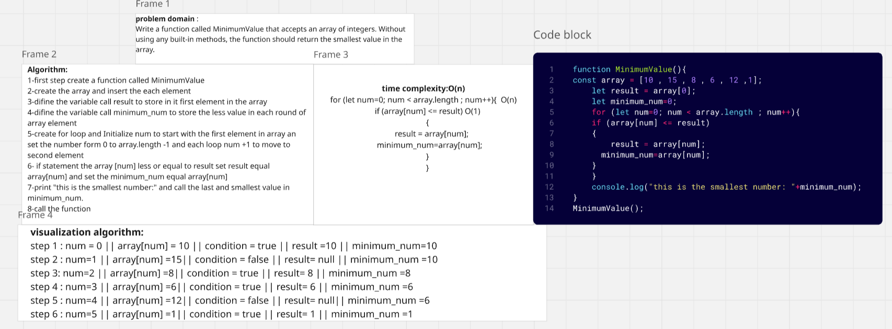
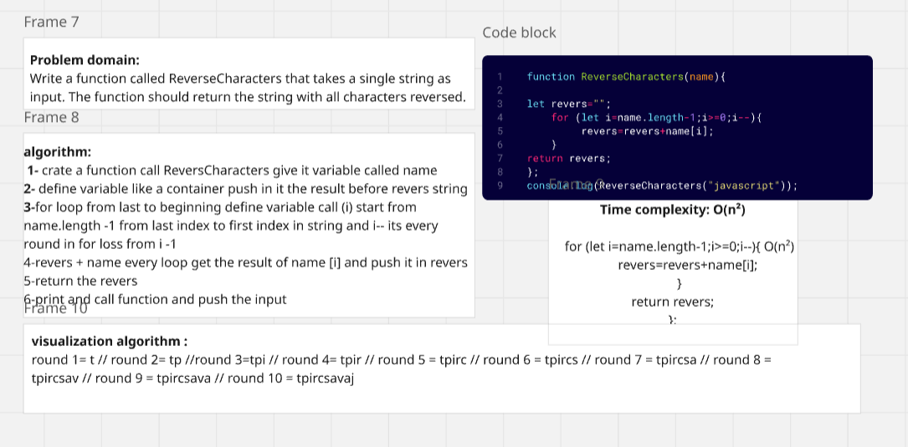
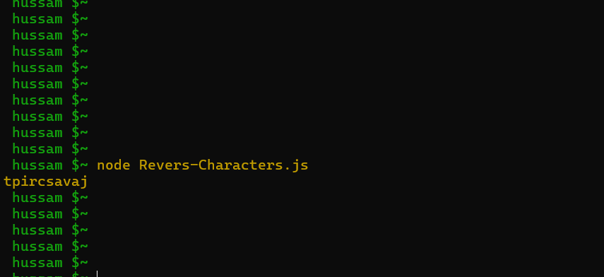
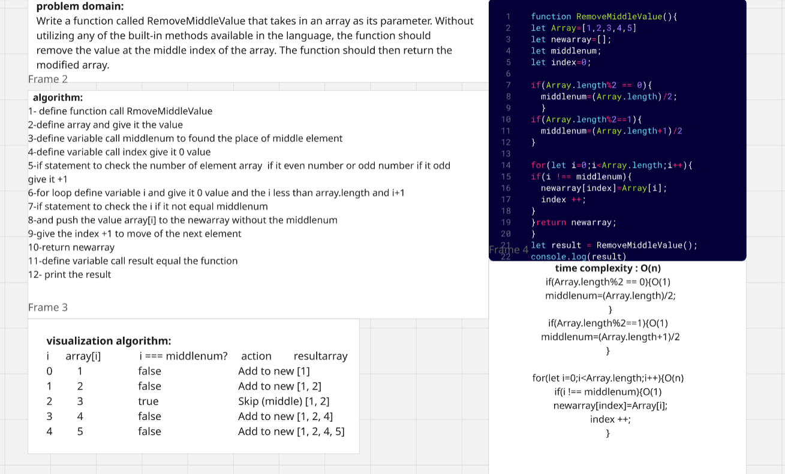
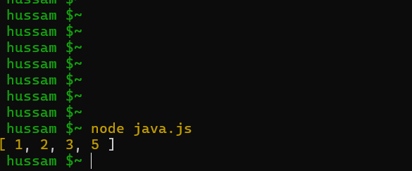

# challenges-and-data-structures

### Whiteboard Images

Here are some images related to the challenges.

### Challenge A: Array Reversal

This is the Array Reversal challenge.

#### Reversed Array Challenge

### Challenge B: Most Frequent Number Challenge

This is the Frequent Number challenge.

### Most Frequent Number Challenge

### Challenge 2:Minimum Value

The challenge is create a java script function call Minimum-Value that identifies and print the smallest number in a given array .
The function should initialize an array with numeric values, use a loop to iterate through each element, and compare each value with a stored minimum.

### challenge 03:Revers Characters

The ReverseCharacters(name) function in JavaScript takes a string as input and returns a new string with the characters in reverse order. It initializes an empty string revers

### Outputs :

### Challenge 04:Remove-Middle-Value

The RemoveMiddleValue function is designed to remove the middle element from a numeric array and return a new array without that middle value. It begins by defining an array, then calculates the middle index using the if statment method to ensure it works correctly with both even and odd lengths

### Output:

### Link README.md File:
For more details, check out the [Linked List Implementation README](DataStructures/LinkedList/Linked-list-Implementation/README.md)

